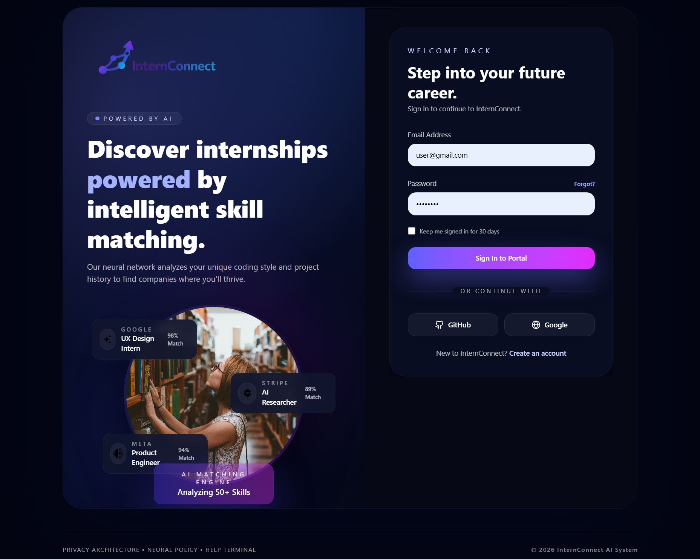
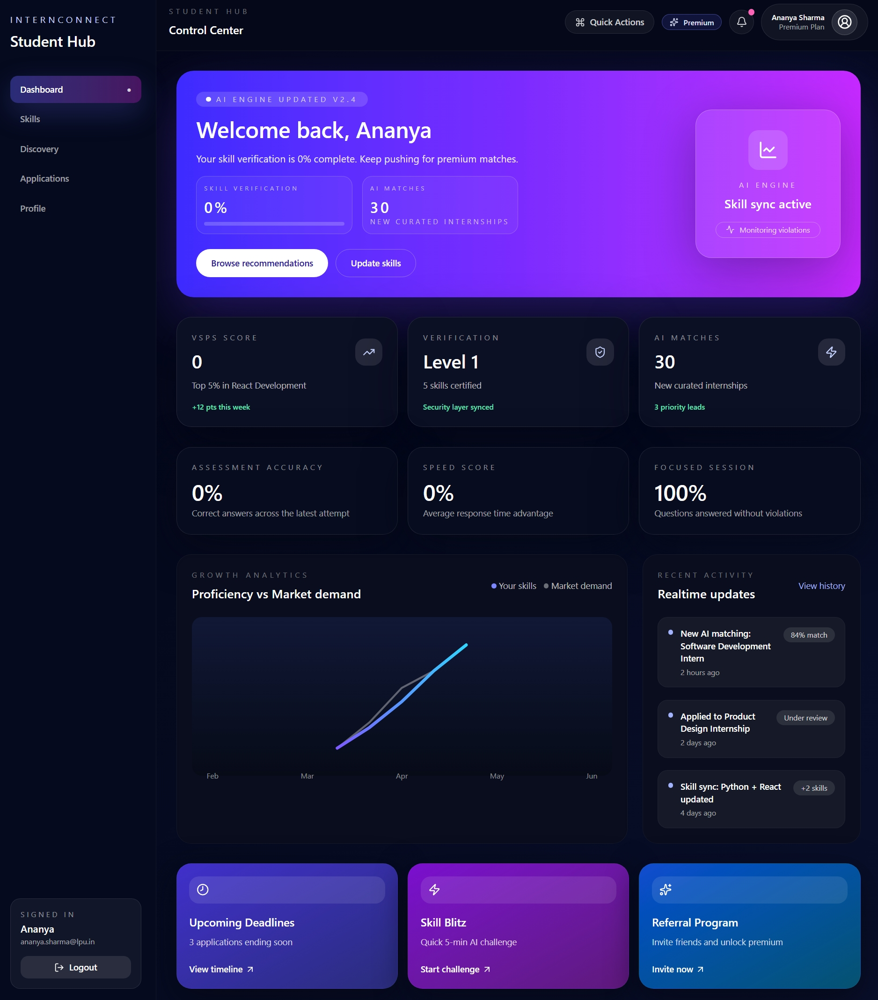
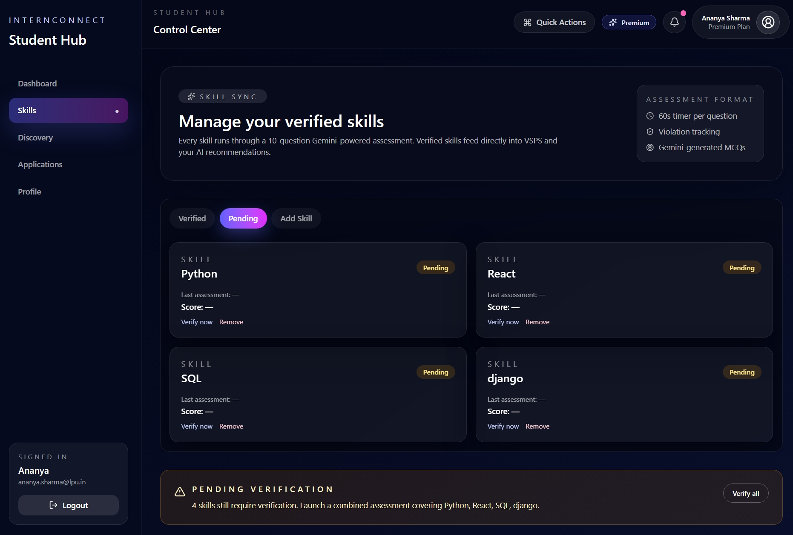
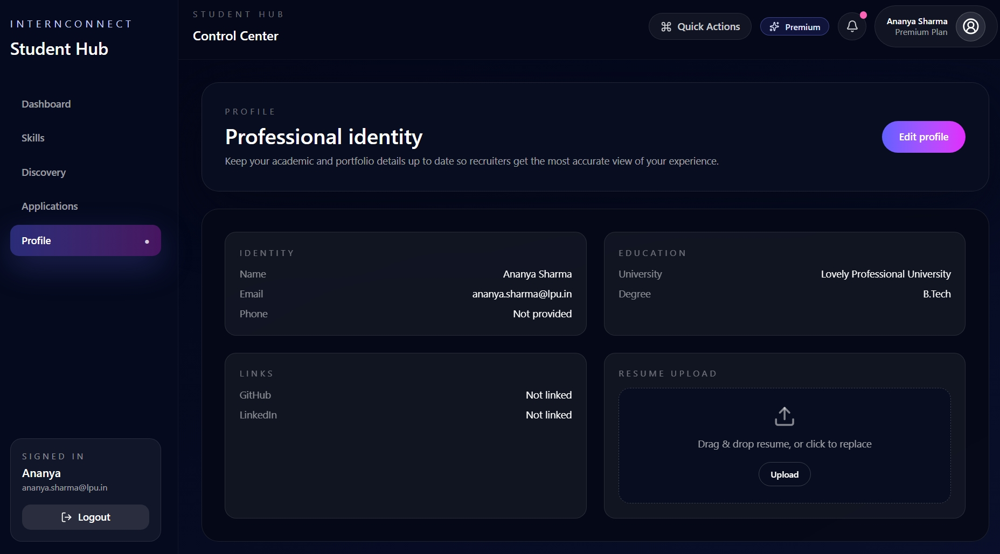
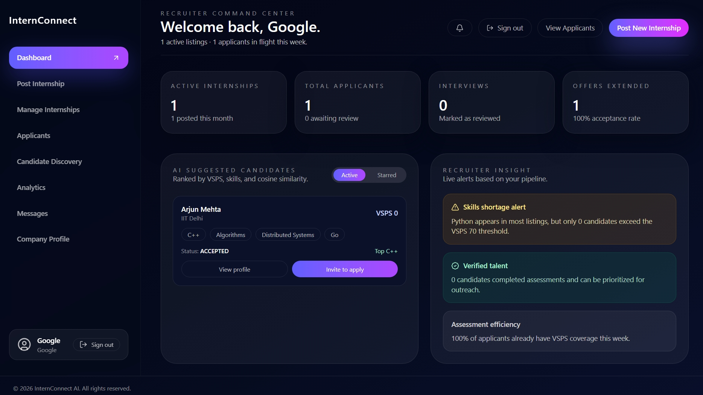
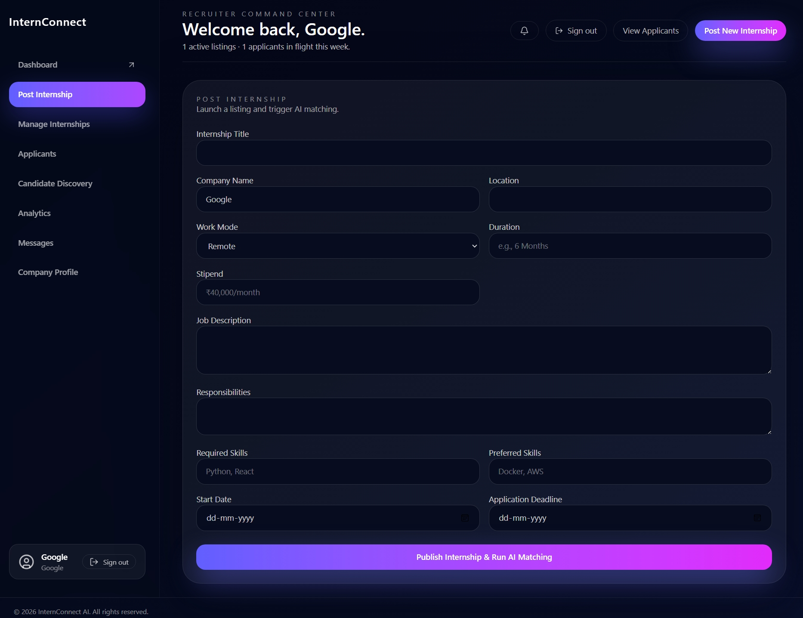
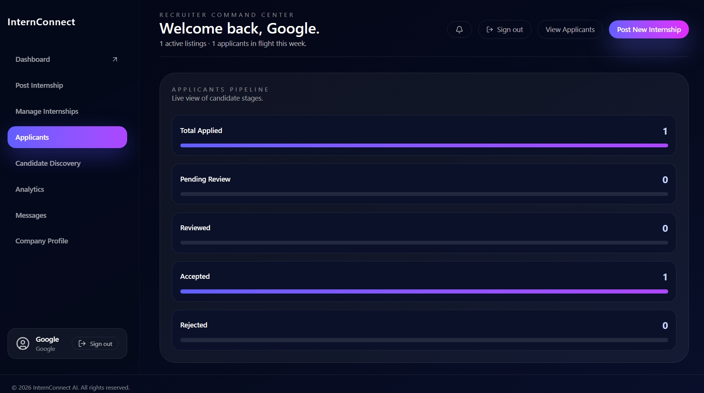
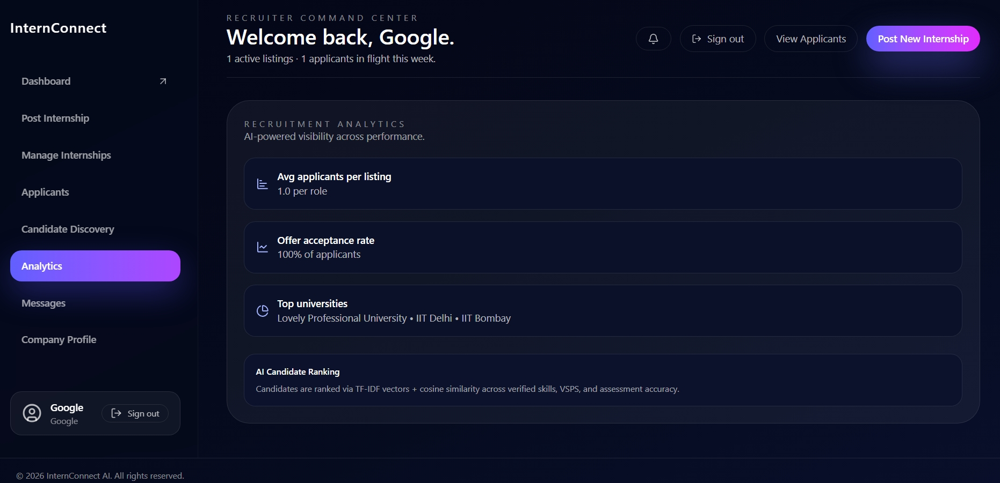

# InternConnect - Intelligent Internship Recommendation System

InternConnect is a comprehensive platform designed to bridge the gap between students and recruiters. It leverages machine learning to provide personalized internship recommendations based on candidate skills, assessment performance, and verification scores (VSPS).


## 📸 Screenshots

| Signup / Login Page | Student Dashboard |
|---------------------|-------------------|
|  |  |

| Verifying Skill Assessment | Student Profile |
|----------------------------|-----------------|
|  |  |

| Recruiter Dashboard | Post Intern Dashboard |
|---------------------|-----------------------|
|  |  |

| List of Applicants | Post Intern |
|--------------------|-------------|
|  |  |

## 🚀 Features

-   **AI-Powered Recommendations**: Uses a custom Recommendation Engine (Cosine Similarity + VSPS Score) to match students with the best internships.
-   **Verification System (VSPS)**: Verified Student Performance Score ensures recruiters see candidates verified for their skills.
-   **Recruiter Dashboard**: Post internships, manage applications, and view candidates ranked by their VSPS score.
-   **Recruiter Branding Controls**: Company name and website flow from signup straight into the dashboard, and can be edited instantly via the in-app modal—no API calls or admin panels required.
-   **Admin Command Center**: Monitor student/recruiter growth, verify organizations, review internship quality, and toggle risk controls (2FA enforcement, auto-approval) from a single analytics-heavy dashboard.
-   **Student Portal**: Take skill assessments, view recommended internships, and apply with one click.
-   **Real-time Notifications**: Instant updates on application status (Planned).
-   **Comprehensive Testing Framework**: 68 automated tests covering backend APIs, frontend components, E2E user journeys, and integration workflows.
-   **CI/CD Pipeline**: Automated testing and deployment with GitHub Actions, coverage reporting, and security scanning.
-   **ML Evaluation Pipeline**: A reproducible `python -m ml_engine.evaluation_pipeline` command now exports research-ready CSVs + charts to `backend/res/` for reporting noise-robustness of the VSPS × Trust model.

## 🛠️ Technology Stack

-   **Frontend**: React.js (Vite), Tailwind CSS, Framer Motion
-   **Backend**: Django REST Framework (Python)
-   **Database**: SQLite (Dev) / PostgreSQL (Prod)
-   **ML Engine**: Scikit-Learn, NumPy, Pandas
-   **Testing**: Jest, React Testing Library, pytest, Playwright, Codecov
-   **CI/CD**: GitHub Actions, Bandit (Security), ESLint

## ☁️ DevOps & Infrastructure

This project implements a robust DevOps pipeline ensuring scalability, reliability, and automated deployment.

### Infrastructure as Code (IaC) - **Terraform**
-   Provisioned AWS infrastructure including VPCs, EC2 instances, and Security Groups.
-   Automated simple and reproducible environment setup.

### Configuration Management - **Ansible**
-   Automated the configuration of EC2 instances.
-   Managed dependencies, installed Docker, and set up environment variables across servers.

### Containerization - **Docker**
-   Both Frontend and Backend are dockerized for consistency across development and production environments.
-   `docker-compose` used for orchestrating multi-container services.

### Cloud Provider - **AWS**
-   Hosted on Amazon Web Services (AWS) using EC2 for compute and S3 for static asset storage.
-   Scalable architecture designed to handle varying loads.

### Monitoring - **Nagios**
-   Real-time monitoring of server health, disk usage, and uptime.
-   Alerting system configured to notify administrators of any downtime or performance anomalies.

## 🧪 Testing Framework

InternConnect includes a comprehensive testing suite ensuring code quality and reliability across all layers.

### Test Coverage
- **Backend**: 33 tests (pytest + Django) - 60%+ API coverage
- **Frontend**: 21 component tests (Jest + React Testing Library)
- **E2E**: 6 user journey tests (Playwright)
- **Integration**: 8 workflow tests (auth + ML engine)
- **Total**: 68 automated tests

### Running Tests

```bash
# Backend tests with coverage
cd backend
source ../.venv/bin/activate  # Activate virtual environment
python -m pytest --cov=. --cov-report=html

# Frontend component tests
cd src
npm test

# E2E tests
npx playwright test

# Integration tests
cd backend
python -m pytest core/test_integration.py -v
```

### CI/CD Pipeline
- Automated testing on every push/PR via GitHub Actions
- Coverage reporting with Codecov
- Security scanning with Bandit
- Multi-stage pipeline: lint → test → build → deploy

## 🏁 Getting Started

### Prerequisites
-   Node.js & npm
-   Python 3.8+
-   Docker (Optional)

### Installation

1.  **Clone the repository**
    ```bash
    git clone https://github.com/nihalsingh571/internrecom.git
    cd internrecom
    ```

2.  **Backend Setup**
    ```bash
    cd backend
    python -m venv ../.venv  # Create virtual environment
    source ../.venv/bin/activate  # Activate virtual environment
    pip install -r requirements.txt
    python manage.py migrate
    python manage.py runserver
    ```

3.  **Frontend Setup**
    ```bash
    cd src
    npm install
    npm run dev
    ```

4.  **Run Tests (Optional but Recommended)**
    ```bash
    # Backend tests
    cd backend
    source ../.venv/bin/activate
    python -m pytest --cov=. --cov-report=term

    # Frontend tests
    cd src
    npm test

    # E2E tests (requires backend running)
    npx playwright test
    ```

### Docker Setup (Alternative)
```bash
docker-compose up --build
```

### 📖 Documentation
- [Testing Guide](TESTING.md) - Comprehensive testing documentation
- [Features](FEATURES.md) - Detailed feature list and roadmap

<!-- CI/CD Trigger: 04/13/2026 01:56:17 -->

<!-- CI/CD Trigger: 04/13/2026 01:57:22 -->
