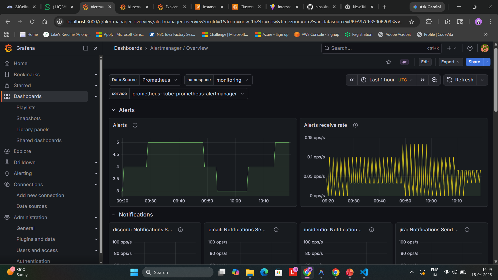
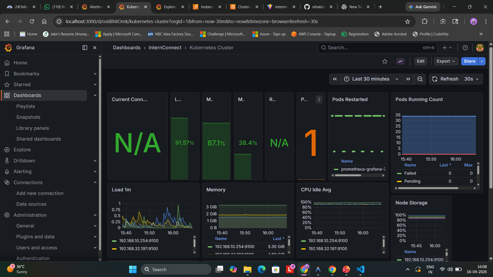
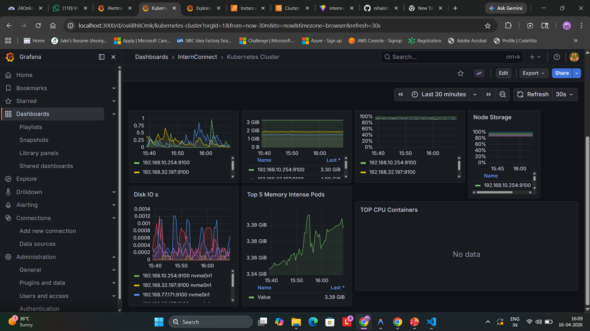

# InternConnect - Intelligent Internship Recommendation System

InternConnect is a comprehensive platform designed to bridge the gap between students and recruiters. It leverages machine learning to provide personalized internship recommendations based on candidate skills, assessment performance, and verification scores (VSPS).

> **🟢 Live Production URL:** [http://k8s-internco-internco-c15f7fe546-2113075165.ap-south-1.elb.amazonaws.com](http://k8s-internco-internco-c15f7fe546-2113075165.ap-south-1.elb.amazonaws.com)

## 📸 Screenshots

| Signup / Login Page | Student Dashboard |
|---------------------|-------------------|
|  |  |

| Verifying Skill Assessment | Student Profile |
|----------------------------|-----------------|
|  |  |

| Recruiter Dashboard | Post Intern Dashboard |
|---------------------|-----------------------|
|  |  |

| List of Applicants | Post Intern |
|--------------------|-------------|
|  |  |

## 🚀 Features

-   **AI-Powered Recommendations**: Uses a custom Recommendation Engine (Cosine Similarity + VSPS Score) to match students with the best internships.
-   **Verification System (VSPS)**: Verified Student Performance Score ensures recruiters see candidates verified for their skills.
-   **Recruiter Dashboard**: Post internships, manage applications, and view candidates ranked by their VSPS score.
-   **Recruiter Branding Controls**: Company name and website flow from signup straight into the dashboard, and can be edited instantly via the in-app modal—no API calls or admin panels required.
-   **Admin Command Center**: Monitor student/recruiter growth, verify organizations, review internship quality, and toggle risk controls (2FA enforcement, auto-approval) from a single analytics-heavy dashboard.
-   **Student Portal**: Take skill assessments, view recommended internships, and apply with one click.
-   **Real-time Notifications**: Instant updates on application status (Planned).
-   **Comprehensive Testing Framework**: 68 automated tests covering backend APIs, frontend components, E2E user journeys, and integration workflows.
-   **CI/CD Pipeline**: Automated testing and deployment with GitHub Actions, coverage reporting, and security scanning.
-   **ML Evaluation Pipeline**: A reproducible `python -m ml_engine.evaluation_pipeline` command now exports research-ready CSVs + charts to `backend/res/` for reporting noise-robustness of the VSPS × Trust model.

## 🛠️ Technology Stack

-   **Frontend**: React.js (Vite), Tailwind CSS, Framer Motion
-   **Backend**: Django REST Framework (Python)
-   **Database**: SQLite (Dev) / PostgreSQL (Prod)
-   **ML Engine**: Scikit-Learn, NumPy, Pandas
-   **Testing**: Jest, React Testing Library, pytest, Playwright, Codecov
-   **CI/CD**: GitHub Actions, Bandit (Security), ESLint

## ☸️ AWS EKS Production Deployment & Infrastructure

The application successfully runs on an **AWS Elastic Kubernetes Service (EKS)** cluster spread across multiple Availability Zones in Mumbai for high availability.

### 🏗️ Architecture & Traffic Flow

- **Infrastructure**: 3 EC2 `t3.medium` instances (6 vCPUs, 12GB RAM total) across 3 Availability Zones.
- **AWS Application Load Balancer (ALB)** routes traffic to the appropriate services:
  - `/api/*` ➔ Django Backend Pods (Autoscaled via HPA)
  - `/auth/*` ➔ Django Auth Pods
  - `/*` ➔ React Frontend Pod ➔ NGINX Proxy
- **Data Layer**:
  - PostgreSQL (StatefulSet backed by AWS EBS for persistent storage)
  - Redis (Caching Layer)

### 🚀 Implementation Phases

The deployment encompasses 14 comprehensive technical phases:

1. **EKS Cluster Creation**: High Availability cluster on AWS.
2. **IAM & OIDC Security**: AWS IAM linked with Kubernetes Service Accounts for secure, password-less pod access.
3. **EBS CSI Driver Configuration**: Dynamic provisioning of persistent volumes via AWS Elastic Block Store (EBS).
4. **AWS Load Balancer Controller**: Automated creation and management of the public ALB through Kubernetes Ingress.
5. **Docker Containerization**: Custom frontend/backend images hosted on Docker Hub.
6. **Data Storage Deployment**: Stateful sets for PostgreSQL and Redis caching.
7. **Database Migrations & Seeding**: Production database initialized with extensive dummy data.
8. **Frontend API Configuration**: Seamless communication established between frontend and Load Balancer via relative paths.
9. **CI/CD Pipeline Integration**: Fully automated GitHub Actions pipeline executing builds and deployments under 4 minutes.
10. **Ingress & Load Balancer Configuration**: Advanced traffic shaping mapped via ALB Ingress controller.
11. **Metrics Server Installation**: Empowered cluster-wide, real-time CPU & RAM utilization tracking.
12. **Horizontal Pod Autoscaling (HPA)**: Automatic scaling logic scaling up backend pods when CPU > 70% or Memory > 80%.
13. **Prometheus Monitoring**: Comprehensive time-series data scraping every 15 seconds across all nodes and pods.
14. **Grafana Dashboards**: Visually rich monitoring interface analyzing pod stability, requests rates, and hardware utilization.

### 📊 System Monitoring & Alerting

We leverage **Prometheus** and **Grafana** to achieve complete observability of our Kubernetes cluster performance, pod health, HPA metrics, and system alerts.

| Alertmanager Overview |
|:---:|
|  |
| *Managing and routing automated alerts triggered by Prometheus rules.* |

| Kubernetes Cluster Metrics (Part 1) | Kubernetes Cluster Metrics (Part 2) |
|:---:|:---:|
|  |  |
| *Real-time visualization of node storage, memory-intensive pods, and disk I/O.* | *Tracking running pods count, CPU Idle Average, cluster load, and memory allocation.* |

## 🧪 Testing Framework

InternConnect includes a comprehensive testing suite ensuring code quality and reliability across all layers.

### Test Coverage
- **Backend**: 33 tests (pytest + Django) - 60%+ API coverage
- **Frontend**: 21 component tests (Jest + React Testing Library)
- **E2E**: 6 user journey tests (Playwright)
- **Integration**: 8 workflow tests (auth + ML engine)
- **Total**: 68 automated tests

### Running Tests

```bash
# Backend tests with coverage
cd backend
source ../.venv/bin/activate  # Activate virtual environment
python -m pytest --cov=. --cov-report=html

# Frontend component tests
cd src
npm test

# E2E tests
npx playwright test

# Integration tests
cd backend
python -m pytest core/test_integration.py -v
```

### CI/CD Pipeline
- Automated testing on every push/PR via GitHub Actions
- Coverage reporting with Codecov
- Security scanning with Bandit
- Multi-stage pipeline: lint → test → build → deploy

## 🏁 Getting Started

### Prerequisites
-   Node.js & npm
-   Python 3.8+
-   Docker (Optional)

### Installation

1.  **Clone the repository**
    ```bash
    git clone https://github.com/nihalsingh571/internrecom.git
    cd internrecom
    ```

2.  **Backend Setup**
    ```bash
    cd backend
    python -m venv ../.venv  # Create virtual environment
    source ../.venv/bin/activate  # Activate virtual environment
    pip install -r requirements.txt
    python manage.py migrate
    python manage.py runserver
    ```

3.  **Frontend Setup**
    ```bash
    cd src
    npm install
    npm run dev
    ```

4.  **Run Tests (Optional but Recommended)**
    ```bash
    # Backend tests
    cd backend
    source ../.venv/bin/activate
    python -m pytest --cov=. --cov-report=term

    # Frontend tests
    cd src
    npm test

    # E2E tests (requires backend running)
    npx playwright test
    ```

### Docker Setup (Alternative)
```bash
docker-compose up --build
```

### 📖 Documentation
- [Testing Guide](TESTING.md) - Comprehensive testing documentation
- [Features](FEATURES.md) - Detailed feature list and roadmap

<!-- CI/CD Trigger: 04/13/2026 01:56:17 -->

<!-- CI/CD Trigger: 04/13/2026 01:57:22 -->
